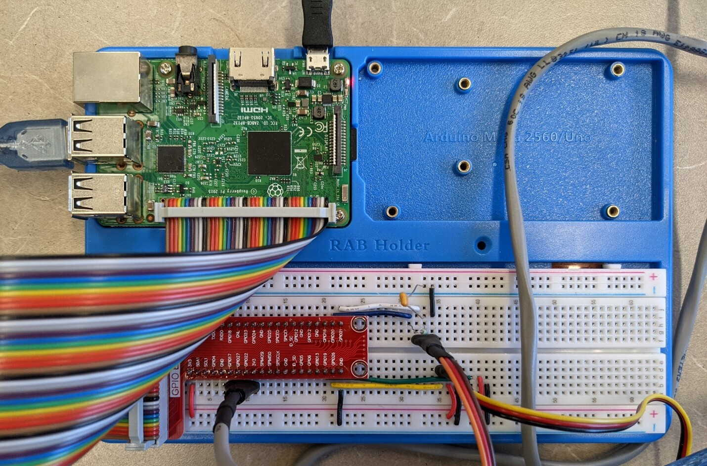
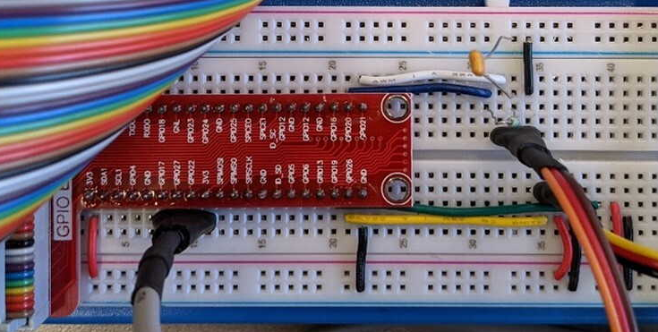
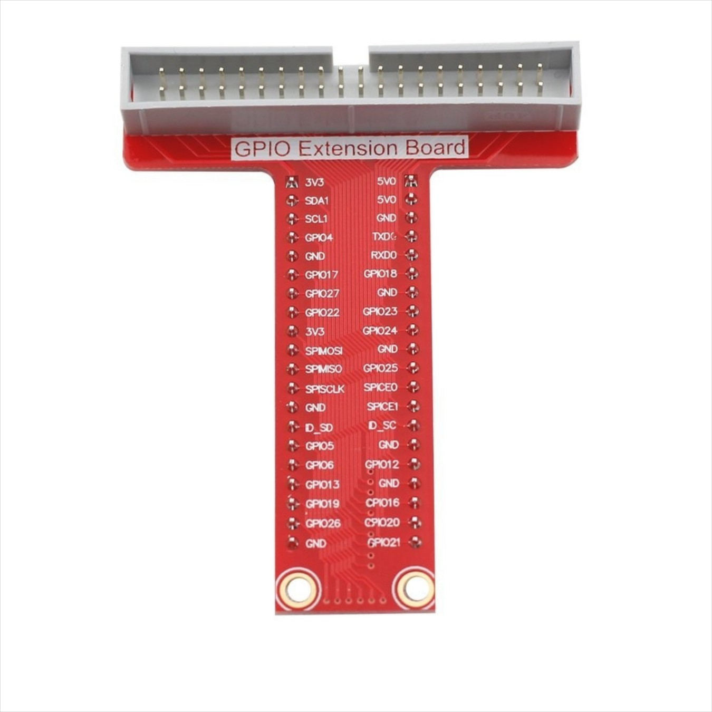

# Notes on transitioning Tensile-Tester electronics from prototype

LA - Linear Actuator

ROT - Two stepper motors on rotary tables they are counter-rotating and connected to one driver

| Prototype RPi GPIO | Description | Final RPi GPIO | 
|:---:|---|:---:|
| 21 | LA_DIRECTION, direction of linear actuator | 21 |
| 20 | LA_DRIVE, power to linear actuator. Lowpass RC filter used to smooth PWM signals | 20 |
| 26 | ROT_SWITCH, switch indicating zero position of rotary tables | 16 |
| 27 | ROT_ENABLE, enable rotary table stepper driver | 27 |
| 22 | ROT_DIRECTION, direction of rotary table rotation | 22 |
| 17 | ROT_DRIVE, drive signal to rotary table stepper motors | 17 |
| 3V3 | Power from RPi to stepper driver | 3V3 |

| Ribbon Wire Colour | Header Pin | RPi GPIO | Description |
|---|:---:|---|---|
| Yellow | 14 | GND | GND  |
| Orange | 13 | 21 |  LA_DIRECTION |
| Red | 12 | GND | GND |
| Brown | 11 | 20 | LA_DRIVE |
| Black | 10 | GND | GND |
| White | 9 | 16 | ROT_SWITCH |
| Gray | 8 | GND | GND |
| Purple| 7 | 3V3 | 3V3 |
| Blue | 6 | GND | GND |
| Green | 5 | 22 | ROT_DIRECTION |
| Yellow | 4 | GND | GND |
| Orange | 3 | 27 | ROT_ENABLE |
| Red | 2 | GND | GND |
| Brown | 1 | 17 | ROT_DRIVE |
